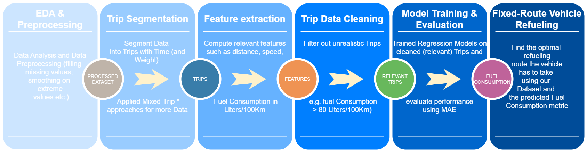

# Cost‑Optimized Refueling for Fixed‑Route Fleets 🚚⛽

A fuel-efficient route optimization system for logistics fleets. This project includes:

- **Fuel-consumption modeling**: Regression-based prediction of trip-level fuel usage.
- **Three optimization strategies**:
  - **Greedy heuristic** – a lightweight, rule-based approach to refueling.
  - **Exhaustive (Cartesian) search** – evaluates all station combinations to find the optimal plan.
  - **Multi‑Objective Linear Programming** – optimizes fuel use, travel time, and access overhead using a weighted objective function.

---

## 📂 Repository Structure

| Notebook | Description |
|---------|-------------|
| `1_EDA_and_Cleaning.ipynb` | Initial data import, exploratory analysis, feature extraction (e.g., distance, elevation, time). |
| `2_Trip_Segmentation.ipynb` | Trip-level segmentation and transformation of raw telemetry into route segments. |
| `3_Model_Training_and_Evaluation.ipynb` | Fuel consumption regression modeling, training, and evaluation (MAE & R²). |
| `4_Fuel_Consumption_Optimization.ipynb` | Implementation of three optimization strategies and comparative evaluation. |

---

## 🚀 Quick Start

1. This project is Jupyter Notebook-based; no `requirements.txt` is needed for standard environments.
2. To run the first notebook (`1_EDA_and_Cleaning.ipynb`), ensure a CSV file named `emisia-sample_dataset_for_msc.csv` is present in the root directory. You may rename it, provided you adjust the file path in the first cell of the notebook.

The CSV must include at least the following columns:

| Feature | Description |
|---------|-------------|
| `datetime` | Timestamp of the record. |
| `mileage_km` | Cumulative kilometers driven. |
| `speed_km_h` | Truck speed at the timestamp (km/h). |
| `elevation_m` | Elevation above sea level (meters). |
| `fuel_volume_lit` | Current fuel volume (liters). |
| `gross_vehicle_weight_kg` | Total vehicle weight (kg). |

---

## 📊 Experimental Results (Summary)

| Evaluation Metric                          | Value (Example) |
|-------------------------------------------|-----------------|
| MAE (Fuel Consumption Prediction)          | 5.07 L         |
| R² (Fuel Consumption Prediction)           | 0.5396          |
| Avg. Fuel Deviation (Greedy vs Exhaustive) | 131 L           |
| Avg. Deviation (MOO vs Exhaustive)         | 25 L            |
| Refueling Strategy Agreement (MOO & EXH)   | 252/500         |
| Fuel-Out Failures (All Methods)            | 0               |

---

## ⚙️ Optimization Timing (Efficiency)

| Method                      | Predicted Data | Actual Data | Relative Time (vs. fastest) |
|----------------------------|----------------|-------------|-----------------------------|
| Greedy Heuristic           | 0.01 s         | 0.0002 s    | ~×1                         |
| Exhaustive (Cartesian)     | 1.24 s         | 0.38 s      | ~×120–310                   |
| Multi-Objective Optimization | 0.31 s       | 0.15 s      | ~×15–77                     |

---

## 📸 Project Pipeline Diagram

---

## 🙏 Acknowledgements

This project was developed in collaboration with **[Colleague's Name]** during our MSc studies. We extend our sincere gratitude to:

- **Professors Anastasios Gounaris and John Paparizos**
- **Phd Candidate Apostolos Gianoulidis** (academic supervisor)
- **Emisia** for industry support and real-world data
- **Michail Perdikopoulos** for continuous guidance and domain expertise

---

## 🔭 Future Work

- Integrate real-time fuel pricing and elevation data for cost-aware planning.
- Extend to stochastic trip modeling (e.g., traffic, delays).
- Explore graph-based route optimization or hybrid learning-optimization models.

---

## 📬 Contact

For any inquiries, feel free to reach out or open an issue in this repository.
